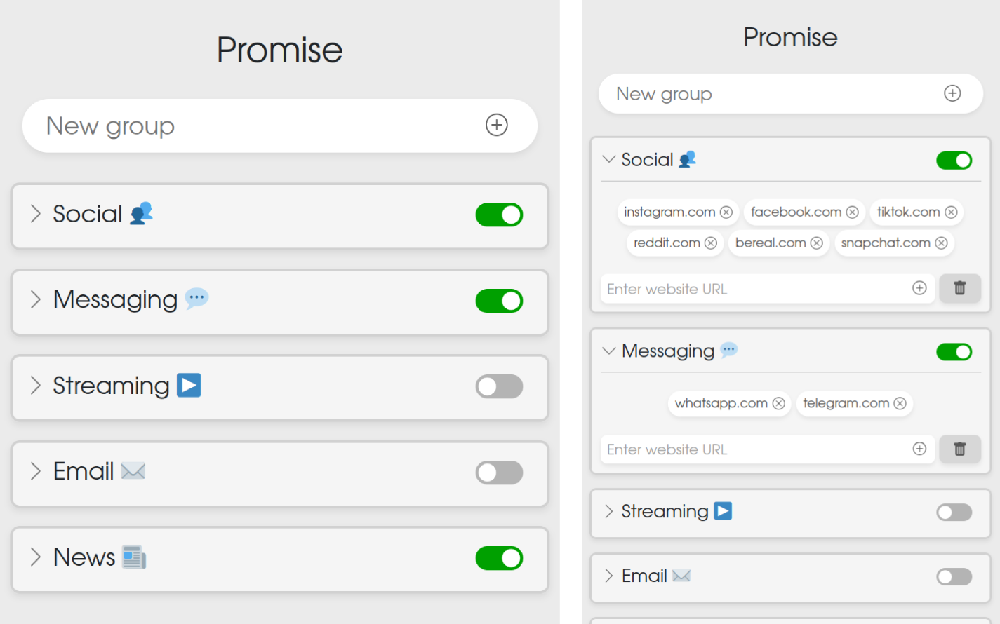

# Promise

Promise is a browser extension designed to help you keep your promises by blocking access to specific websites. Once you add websites to a group, the extension will prevent you from visiting those sites, helping you stay focused and productive.

## Features

- **Group Management**: Create and manage groups of websites.
- **Website Blocking**: Block access to websites added to any active group.
- **Toggle Group Activity**: Easily activate or deactivate groups.
- **Persistent Storage**: Save your groups and websites in the browser's local storage to maintain them between sessions.
- **User-Friendly Interface**: Simple and intuitive UI for managing your groups and websites.

## Usage

1. Click on the extension icon to open the popup.
2. Enter a new group title in the input field and either press "Enter" or click the "Add" button.
3. Add websites to the group by entering the URL and by either pressing "Enter" or clicking the "Add" button next to the input field.
4. Toggle the group's activity using the switch next to the group title.
5. The extension will block access to websites in active groups.

## Key Files

- **background/background.js**: Contains the logic for blocking websites based on active groups.
- **popup/popup.html**: The HTML file for the extension's popup interface.
- **popup/popup.js**: The JavaScript file for handling user interactions in the popup.
- **pages/keep-your-promise.html**: The page displayed when a blocked website is accessed.
- **bootstrap-5.3.3-dist/css/bootstrap.css**: Bootstrap CSS for styling the popup.

## Contributing

Contributions are welcome! Please open an issue or submit a pull request for any improvements or bug fixes.

---

Enjoy a more focused and productive browsing experience with Promise!